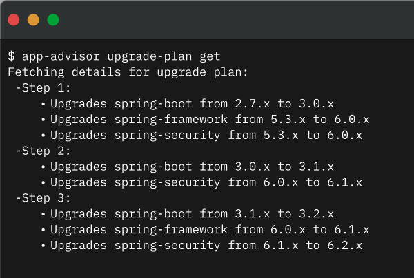
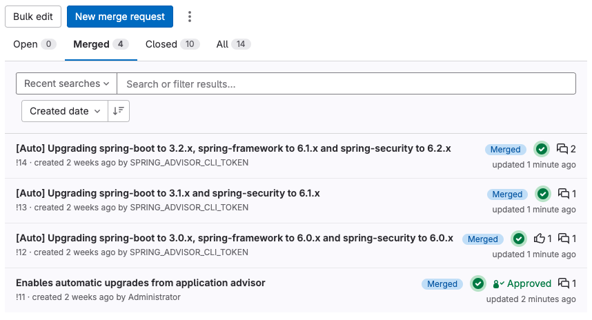
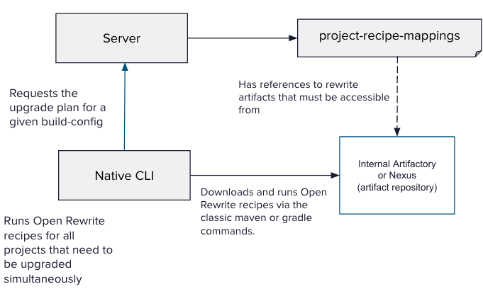

**Spring Application Advisor** [(Docs)](https://docs.vmware.com/en/Tanzu-Spring-Runtime/Commercial/Tanzu-Spring-Runtime/index-app-advisor.html) is a *VMware Tanzu Spring* capability for continuously and incrementally upgrading Spring dependencies in all your Git repositories.

Spring Application Advisor detects if there is a new version available for upgrading your Spring dependencies, and automatically applies necessary changes in your build configuration and Java files with the help of **OpenRewrite**.

To make those changes available for review, *Spring Application Advisor* is able to create pull requests to make it as easy as possible to integrate it into the existing CI/CD processes.

#### OpenRewrite

[OpenRewrite](https://openrewrite.org/) is an automated refactoring ecosystem for source code, enabling developers to effectively eliminate technical debt within their repositories at scale.

It consists of an auto-refactoring engine that runs prepackaged, refactoring recipes for common framework migrations, security fixes, and stylistic consistency tasks – reducing your coding effort from hours or days to minutes. Build tool plugins like the OpenRewrite Gradle plugin and the OpenRewrite Maven plugin help you run these recipes on one repository at a time.

In addition to the recipes available as open-source, *Spring Application Advisor* also has access to our commercial recipes built with the expertise of the Spring team.

#### How *Spring Application Advisor* works
*Spring Application Advisor* is a package that is composed of a **native CLI and a Server application**.

The **native CLI** is responsible for:
- Generating the dependency tree and the build tool versions of a Git repository
- Running the refactors that apply the corresponding dependency version changes and Java API upgrades, if needed, using the *OpenRewrite* recipes reported by the server
- (Optional) Creating pull requests with the refactors

It is assumed that the **CLI is integrated into the CI/CD pipeline**, so that the Git repositories are continuously analyzed and upgraded to the next version, if necessary. 

The **Server** is responsible for computing the upgrade plan, which is the list of Spring dependencies or tools that must be upgraded together (using *OpenRewrite* recipes) to the next release.

The Server also stores the dependency trees and build tool versions that have been inferred from each build. By default, this information is stored in memory, but can be stored in a SQL database.