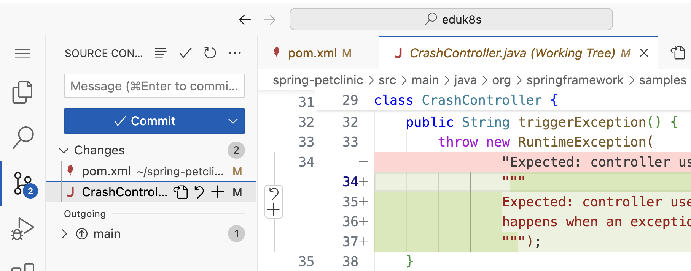
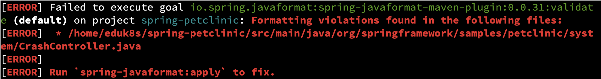

To execute the further steps of our upgrade plan, we have to rerun the commands that produce and publish the build configuration.
```execute
advisor build-config get
advisor build-config publish --url=${APP_ADVISOR_SERVER}
advisor upgrade-plan get --url=${APP_ADVISOR_SERVER}

```
If the first upgrade step was succesfully applied, you should now see that the next step is the **Java 11 to 17 upgrade**, which is a requirement for Spring Boot 3.x.


Let's execute the next upgrade step.
```execute
advisor upgrade-plan apply --url=${APP_ADVISOR_SERVER}
```

To discover the changes, we will use the *Source Control view* of the embedded editor again.  
```editor:execute-command
command: workbench.view.scm
description: Open the "Source Control" view in editor
```
In addition to the Java version change in the `pom.xml`, also a change regarding the multi-line string support intoduced in Java 17 was applied in a source code file.


Before we commit and push the changes, let's compile and run the application to check whether everything still works. 

As we upgraded our source code to Java 17, we also have to change the Java runtime in our environment before running the appplication.
```terminal:execute
command: sdk use java $(sdk list java | grep installed | grep "17.*[0-9]-librca" | awk '{print $NF}' | head -n 1)
session: 1
cascade: true
```
```terminal:execute
command: sdk use java $(sdk list java | grep installed | grep "17.*[0-9]-librca" | awk '{print $NF}' | head -n 1)
session: 2
hidden: true
```
```terminal:execute
command: ./mvnw spring-boot:run
session: 2
```

Unfortunately, the Maven `spring-boot:run` goal fails in the validate phase due to **source code formatting violations** introduced by our automated upgrade. 

In the error details, you can also see an hint how you may be able to fix this by running `mvn spring-javaformat:apply`.


Spring Application Advisor is trying to preserve your coding style by doing the minimum required changes in the source files. However, it doesn't take Maven or Gradle formatters used in your projects like in this case `spring-javaformat` into account. 


Fortunatley, we can use the already introdcued `--after-upgrade-cmd` option of the `advisor upgrade-plan apply` command to automatically execute the `spring-javaformat:apply` Maven goal after applying the upgrade plan. 

To test this out, let's first revert the changes of the last upgrade set before we run it again with the added option.
```execute
git restore .
```
```execute
advisor upgrade-plan apply --url=${APP_ADVISOR_SERVER} --after-upgrade-cmd=spring-javaformat:apply
```

We can validate thath everything worked as expected by compiling and running our application again.
```terminal:execute
command: ./mvnw spring-boot:run
session: 2
```

```dashboard:open-url
url: ://petclinic-.
```

```terminal:interrupt
session: 2
```

Switch to the *Source Control view* of the embedded editor to **commit and push the changes**.
Don't forget to enter a commit message. Otherwise, you have to add it to the file that will be opened in the editor and close the file.
```editor:execute-command
command: workbench.view.scm
description: Open the "Source Control" view in editor
```